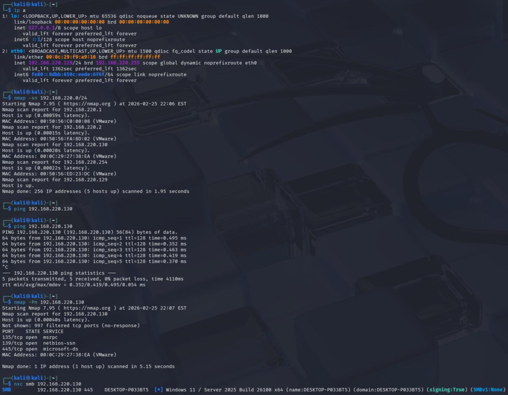
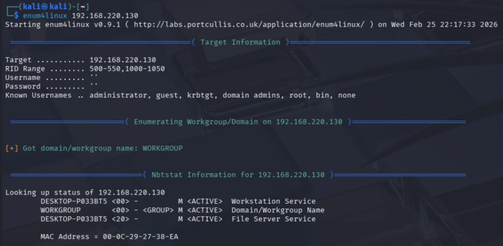
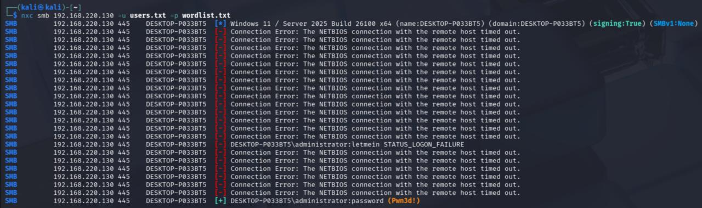
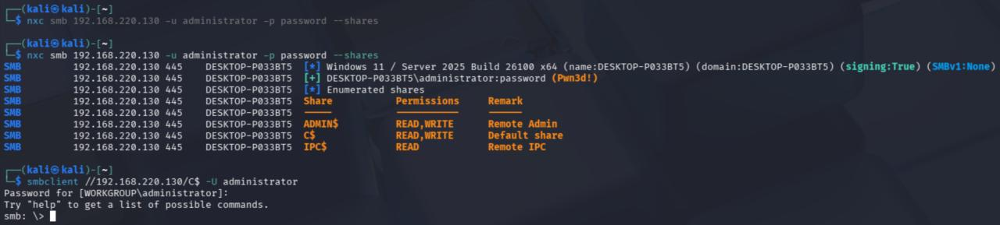
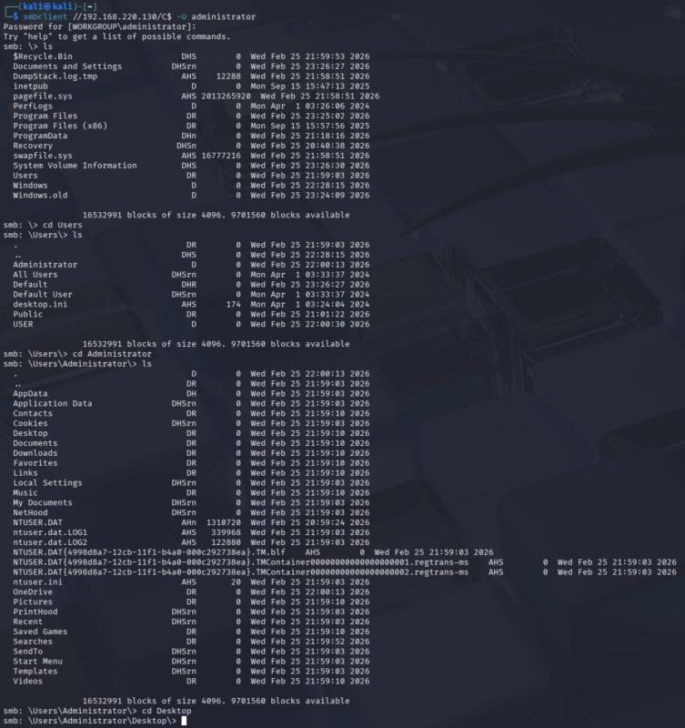
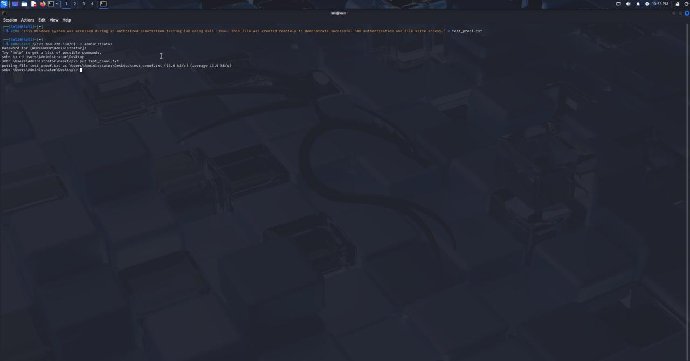
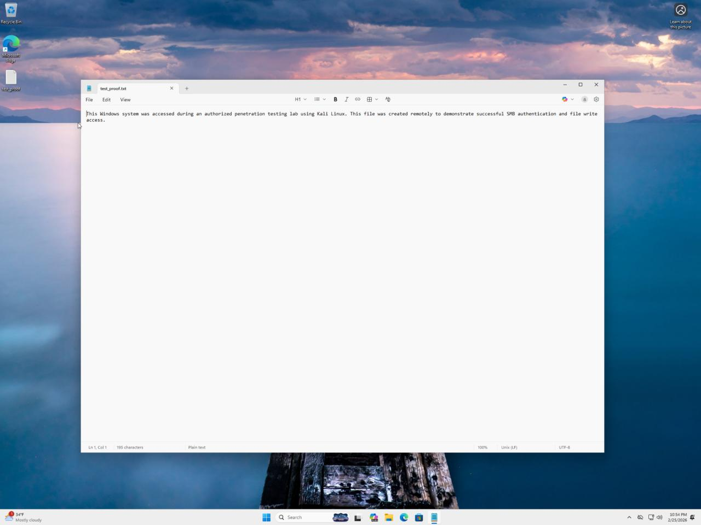

# SMB Security Audit Lab

Conducted an internal network security assessment within a virtualized lab environment to identify and exploit Server Message Block (SMB) vulnerabilities. This project demonstrates practical proficiency in network enumeration, credential attacks, and post-exploitation techniques using Kali Linux.

## Phase 1: Network Reconnaissance
**Action:** Performed network reconnaissance using Nmap to identify exposed SMB and RPC services.

## Phase 2: SMB Enumeration
**Action:** Conducted SMB enumeration with `enum4linux` to identify valid usernames and domain/workgroup information.

## Phase 3: Credential Attack
**Action:** Generated custom username and password wordlists for credential testing. Utilized `NetExec` to perform targeted dictionary attacks against the exposed SMB services.

## Phase 4: System Authentication
**Action:** Successfully identified valid credentials (`administrator:password`) and authenticated to the target system via `smbclient`.

## Phase 5: Post-Exploitation & File System Access
**Action:** Navigated the administrative `C$` share to verify full read/write access to the root file system.

**Proof of Concept:** Created a proof-of-concept text file locally on Kali Linux and remotely transferred it to the target's desktop via SMB to demonstrate write privileges.

**Target Verification:** Confirmed the payload was successfully deposited and readable on the endpoint.

